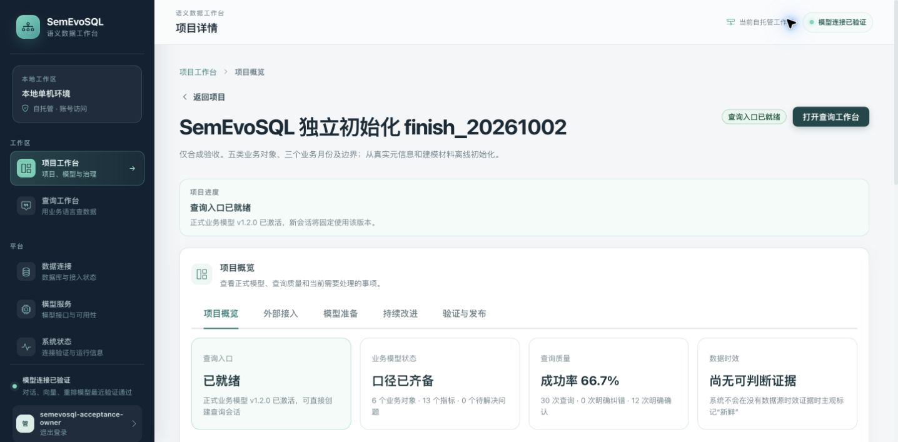
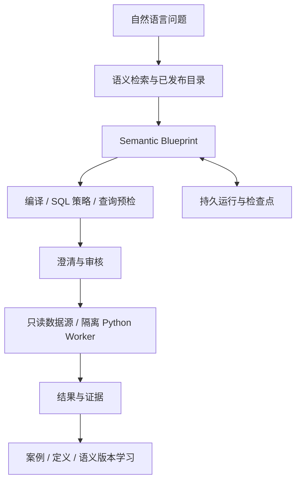

<div align="center">

# SemEvoSQL

**把自然语言问题转换为有语义依据、可校验、可恢复的只读查询。**

语义目录 · Semantic Blueprint · SQL 编译 · 问询澄清 · 持久执行与学习

[](pom.xml)
[](frontend/package.json)
[](LICENSE)

[快速开始](#快速开始) · [架构](#架构) · [开发与验证](#开发与验证) · [当前状态](#当前状态)

</div>

SemEvoSQL 是面向业务问数的 NL2SQL 平台。模型使用已发布的语义目录理解指标、维度、关联和时间口径，生成 Semantic Blueprint；服务端编译和校验 SQL，再由只读数据源执行。口径缺失或存在歧义时，流程向用户澄清，保留修订和审批依据。

## 使用流程

1. 配置实际模型服务，接入只读业务数据库并创建项目。
2. 按初始化协议生成语义目录，导入、校验、建立索引后发布。
3. 用自然语言提问；必要时补充口径，查看计划和生成的 SQL。
4. 审核查询，读取结果、图表、引用和执行记录。
5. 把已验证的修订与案例纳入后续语义版本；个人定义按权限贡献到公共层。



## 核心能力

| 领域 | 能力 |
| --- | --- |
| 语义初始化 | 物理绑定、指标、维度、关系、时间、别名、规则和证据的完整目录协议 |
| 规划与编译 | Semantic Blueprint、确定性 SQL 编译、作用域校验和查询预检 |
| 只读执行 | MySQL / PostgreSQL、成本与期限控制、结果校验、受限 Python 执行器 |
| 问询与审批 | 多轮澄清、用户修订、计划审核、旧请求与旧目标栅栏 |
| 检索与学习 | Exact / BM25 / Vector 融合，可选 Rerank，案例与定义版本管理 |
| 项目治理 | 发布、回放、个人定义、贡献审核、项目权限和窄契约 MCP |

初始化和发布是正式流程。问询发现的缺口进入修订、审批与发布，不能只为某一道题手工增加模板。公共口径与个人定义有独立的权限和版本边界。

## 架构



后端以模块化单体组织语义、SQL、运行、学习和安全边界。前端将领域 API 与契约分开，共用项目页面标题、流程指引和导航规则。浏览器断开不等于后台运行成功或失败。

## 快速开始

需要 Docker Compose v2。开发和当前完整回归使用 JDK 17；前端使用 Node.js 22.x（22.13.0 起）或 24+ 与 npm，CI 固定 Node.js 22.13.0。

```sh
git clone https://github.com/lgs0809/SemEvoSQL.git
cd SemEvoSQL
./scripts/init-deployment-env.sh
./scripts/start-semevosql.sh
```

初始化脚本创建私密配置并拒绝覆盖。默认页面为 **[http://127.0.0.1:23000/semevosql/](http://127.0.0.1:23000/semevosql/)**，API 为 **[http://127.0.0.1:28065](http://127.0.0.1:28065)**。先在控制台配置并验证模型；业务数据库和语义项目不会自动建立。

本地访问控制通过 `SEMEVOSQL_LOCAL_SECURITY_JSON` 配置。启用时必须有账户，否则拒绝启动；配置包含密码 Hash、管理员角色与项目范围，不提供固定默认密码。默认关闭安全的开发模式只用于 loopback 本机。当前隔离验收环境已启用多账号和项目权限。

验收页面为 **[http://127.0.0.1:3303/semevosql/](http://127.0.0.1:3303/semevosql/)**，API 为 **[http://127.0.0.1:18093](http://127.0.0.1:18093)**。业务种子 SQL、查询真值与初始化流程保留在 [验收目录](deploy/acceptance/)，手动使用见 [目录初始化](deploy/acceptance/catalog-initialization.md)。

Python 在独立 Worker 中执行，使用无网络、只读文件系统、非 root 用户及资源限制。应用进程不持有 Docker daemon 访问权；Worker 是受信任的内部组件。

## 开发与验证

```sh
./mvnw verify
cd frontend && npm ci && npm run verify
cd .. && ./scripts/check-release-hygiene.sh
```

实际数据库回归使用 `scripts/test-backend-with-databases.py`；本地运行及受测页面部署使用 `scripts/local-acceptance.py` 和 `scripts/deploy-tested-web-acceptance.py`。先阅读参数及 [当前验收状态](docs/acceptance/CURRENT-STATUS.md)，保留原数据、检查点与失败记录。

```text
backend/src/main/java/cn/lgs/semevosql/
  semantic/                目录、Blueprint 与版本
  sql/                     执行保护和校验
  conversation/            多轮请求上下文
  common/security/         身份与项目范围
frontend/src/
  views/                   业务工作台
  components/              共用交互与流程组件
  services/semevosql/       领域 API、契约及兼容入口
deploy/acceptance/          关联业务种子 SQL 与查询真值
scripts/                   初始化、部署、恢复及只读检查
docs/                      开发说明和分批验收记录
```

MCP 对已发布项目提供 `query` 和 `query_status`。外部 Agent 用自然语言提交并查询持久运行状态；检索、编译、权限和恢复仍在服务端执行。

## 当前状态

最新后端完整 PostgreSQL / MySQL 回归 **1000 / 1000 通过**，新产物已正常部署至本机验收环境。默认空账户启动及启用账户后的权限边界已分别验证；这些检查不代表正式问数质量评测通过。初始化、正常发布、多轮问询及个人定义贡献已有分批真实组件和页面证据，前端重构另行验证构建与工作区页面。

仍未完成：公共口径选择的完整回答，完整修复与取消故障矩阵，多源分页，部分歧义及数值边界，真实缓存复用和剩余正式评测。正式样本存在失败，重排有真实超时与回退；不宣称全量问数质量达标。详见 [当前状态与恢复入口](docs/acceptance/CURRENT-STATUS.md)。

## License

[Apache License 2.0](LICENSE)。
